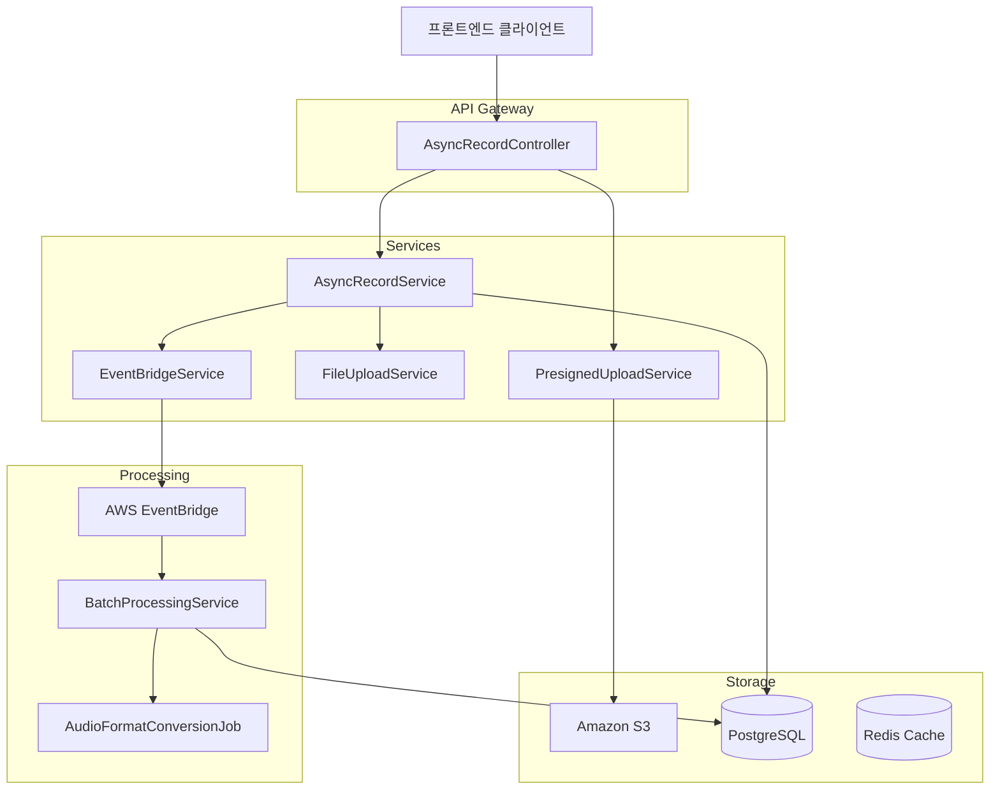
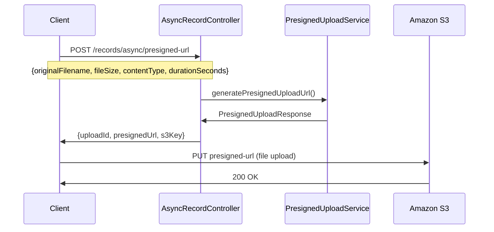
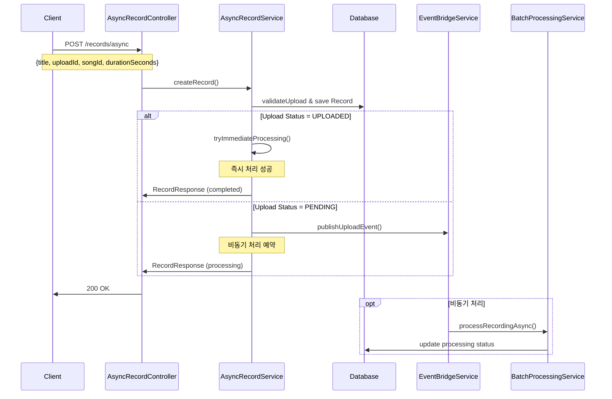

# Spotify 스타일 Recording API 분리 구현 문서

## 📋 목차
1. [개요](#개요)
2. [아키텍처 설계](#아키텍처-설계)
3. [API 문서](#api-문서)
4. [구현 세부사항](#구현-세부사항)
5. [데이터베이스 스키마](#데이터베이스-스키마)
6. [배치 처리 시스템](#배치-처리-시스템)
7. [에러 핸들링](#에러-핸들링)
8. [프론트엔드 연동](#프론트엔드-연동)
9. [성능 및 모니터링](#성능-및-모니터링)
10. [운영 가이드](#운영-가이드)

---

## 개요

### 🎯 목적
기존의 단일 API 구조를 Spotify/SoundCloud와 같은 현업 수준의 분리된 API 구조로 리팩토링하여:
- **사용자 경험 개선**: 파일 업로드와 메타데이터 입력의 독립적 처리
- **시스템 안정성 향상**: 즉시 처리 + 비동기 처리 하이브리드 구조
- **확장성 확보**: 마이크로서비스 원칙에 부합하는 API 설계

### 🔄 변경 사항 요약

#### Before (기존 구조)
```
POST /records/async/presigned-url
- 파라미터: title, songId, originalFilename, fileSize, contentType, durationSeconds
- 동작: Presigned URL 생성 + Record 메타데이터 DB 저장 (동시 처리)
```

#### After (개선된 구조)
```
1. POST /records/async/presigned-url
   - 파라미터: originalFilename, fileSize, contentType, durationSeconds
   - 동작: 순수 파일 업로드용 Presigned URL 생성

2. POST /records/async
   - 파라미터: title, uploadId, songId, durationSeconds
   - 동작: Record 메타데이터 저장 + 즉시/비동기 처리
```

---

## 아키텍처 설계

### 🏗️ 전체 시스템 아키텍처



### 🔄 처리 플로우

#### 1. 파일 업로드 플로우


#### 2. Record 생성 및 처리 플로우


---

## API 문서

### 🔗 Base URL
```
https://api.orak.ssafy.com/records/async
```

### 📤 1. Presigned URL 생성

#### Endpoint
```http
POST /records/async/presigned-url
```

#### Description
파일 업로드를 위한 Presigned URL을 생성합니다. 메타데이터(제목 등)는 별도로 처리됩니다.

#### Request Parameters
| Parameter | Type | Required | Description |
|-----------|------|----------|-------------|
| originalFilename | String | Yes | 원본 파일명 (예: "recording.mp3") |
| fileSize | Long | Yes | 파일 크기 (bytes) |
| contentType | String | Yes | MIME 타입 (예: "audio/mpeg") |
| durationSeconds | Integer | No | 오디오 재생 시간 (초) |

#### Request Example
```bash
curl -X POST "https://api.orak.ssafy.com/records/async/presigned-url" \
  -H "Authorization: Bearer YOUR_JWT_TOKEN" \
  -H "Content-Type: application/x-www-form-urlencoded" \
  -d "originalFilename=my-recording.mp3" \
  -d "fileSize=2048000" \
  -d "contentType=audio/mpeg" \
  -d "durationSeconds=180"
```

#### Response
```json
{
  "uploadId": 12345,
  "presignedUrl": "https://orakgaraki-bucket.s3.amazonaws.com/recordings/abc123_my-recording.mp3?X-Amz-Algorithm=...",
  "s3Key": "recordings/abc123_my-recording.mp3",
  "expirationTime": "2024-01-01T12:00:00Z"
}
```

#### Response Fields
| Field | Type | Description |
|-------|------|-------------|
| uploadId | Long | 업로드 ID (Record 생성 시 사용) |
| presignedUrl | String | S3 업로드용 Presigned URL |
| s3Key | String | S3 객체 키 |
| expirationTime | String | URL 만료 시간 (ISO 8601) |

### 📝 2. Record 생성

#### Endpoint
```http
POST /records/async
```

#### Description
업로드된 파일에 대한 Record 메타데이터를 생성하고 오디오 처리를 시작합니다.

#### Request Body
```json
{
  "title": "내 첫 번째 녹음",
  "uploadId": 12345,
  "songId": 67890,
  "durationSeconds": 180
}
```

#### Request Fields
| Field | Type | Required | Description |
|-------|------|----------|-------------|
| title | String | Yes | 녹음 제목 |
| uploadId | Long | Yes | Presigned URL 생성 시 받은 업로드 ID |
| songId | Long | No | 연관된 노래 ID |
| durationSeconds | Integer | No | 오디오 재생 시간 (초) |

#### Request Example
```bash
curl -X POST "https://api.orak.ssafy.com/records/async" \
  -H "Authorization: Bearer YOUR_JWT_TOKEN" \
  -H "Content-Type: application/json" \
  -d '{
    "title": "내 첫 번째 녹음",
    "uploadId": 12345,
    "songId": 67890,
    "durationSeconds": 180
  }'
```

#### Response
```json
{
  "id": 98765,
  "title": "내 첫 번째 녹음",
  "userId": 123,
  "songId": 67890,
  "uploadId": 12345,
  "durationSeconds": 180,
  "processingStatus": "COMPLETED",
  "s3Key": "recordings/abc123_my-recording.mp3",
  "publicUrl": "https://cdn.orak.ssafy.com/recordings/abc123_my-recording.mp3",
  "createdAt": "2024-01-01T12:00:00Z",
  "updatedAt": "2024-01-01T12:00:30Z"
}
```

#### Response Fields
| Field | Type | Description |
|-------|------|-------------|
| id | Long | Record ID |
| title | String | 녹음 제목 |
| userId | Long | 사용자 ID |
| songId | Long | 연관된 노래 ID |
| uploadId | Long | 업로드 ID |
| durationSeconds | Integer | 오디오 재생 시간 (초) |
| processingStatus | String | 처리 상태 (COMPLETED/PROCESSING/FAILED) |
| s3Key | String | S3 객체 키 |
| publicUrl | String | 공개 접근 URL |
| createdAt | String | 생성 시간 (ISO 8601) |
| updatedAt | String | 수정 시간 (ISO 8601) |

### 📋 3. Record 조회

#### Endpoint
```http
GET /records/async/{recordId}
```

#### Response
```json
{
  "id": 98765,
  "title": "내 첫 번째 녹음",
  "userId": 123,
  "songId": 67890,
  "uploadId": 12345,
  "durationSeconds": 180,
  "processingStatus": "COMPLETED",
  "s3Key": "recordings/abc123_my-recording.mp3",
  "publicUrl": "https://cdn.orak.ssafy.com/recordings/abc123_my-recording.mp3",
  "createdAt": "2024-01-01T12:00:00Z",
  "updatedAt": "2024-01-01T12:00:30Z"
}
```

### 📋 4. 내 Record 목록 조회

#### Endpoint
```http
GET /records/async/me
```

#### Response
```json
[
  {
    "id": 98765,
    "title": "내 첫 번째 녹음",
    "userId": 123,
    "songId": 67890,
    "uploadId": 12345,
    "durationSeconds": 180,
    "processingStatus": "COMPLETED",
    "s3Key": "recordings/abc123_my-recording.mp3",
    "publicUrl": "https://cdn.orak.ssafy.com/recordings/abc123_my-recording.mp3",
    "createdAt": "2024-01-01T12:00:00Z",
    "updatedAt": "2024-01-01T12:00:30Z"
  }
]
```

### ❌ 5. Record 삭제

#### Endpoint
```http
DELETE /records/async/{recordId}
```

#### Response
```
204 No Content
```

---

## 구현 세부사항

### 🎯 핵심 컴포넌트

#### 1. CreateRecordRequest DTO
```java
@Data
@Builder
@NoArgsConstructor
@AllArgsConstructor
public class CreateRecordRequest {
    @NotBlank(message = "제목은 필수입니다")
    private String title;

    @NotNull(message = "업로드 ID는 필수입니다")
    private Long uploadId;

    private Long songId;

    /**
     * 오디오 파일 재생 시간 (초)
     * - 녹음: 프론트에서 녹음 시간 측정
     * - 외부파일: 프론트에서 HTML5 Media API로 duration 추출
     */
    private Integer durationSeconds;
}
```

#### 2. AsyncRecordController 주요 메서드
```java
@PostMapping("/presigned-url")
public ResponseEntity<PresignedUploadResponse> generatePresignedUrl(
        @RequestParam("originalFilename") @NotBlank String originalFilename,
        @RequestParam("fileSize") @Positive Long fileSize,
        @RequestParam("contentType") @NotBlank String contentType,
        @RequestParam(value = "durationSeconds", required = false) Integer durationSeconds,
        @AuthenticationPrincipal CustomUserPrincipal principal) {

    // PresignedUploadService 직접 호출로 변경
    PresignedUploadRequest request = PresignedUploadRequest.builder()
            .originalFilename(originalFilename)
            .fileSize(fileSize)
            .contentType(contentType)
            .directory("recordings")
            .build();

    PresignedUploadResponse response = presignedUploadService
            .generatePresignedUploadUrl(request, principal.getUserId());

    return ResponseEntity.ok(response);
}

@PostMapping("")
public ResponseEntity<RecordResponseDTO> createRecord(
        @RequestBody @Valid CreateRecordRequest request,
        @AuthenticationPrincipal CustomUserPrincipal principal) {

    RecordResponseDTO response = asyncRecordService.createRecord(request, principal.getUserId());
    return ResponseEntity.ok(response);
}
```

#### 3. AsyncRecordService 핵심 로직
```java
@Transactional
public RecordResponseDTO createRecord(CreateRecordRequest request, Long userId) {
    // 1. Upload 존재 및 상태 검증
    Upload upload = validateUploadForRecord(request.getUploadId(), userId);

    // 2. Record 생성
    Record record = Record.builder()
            .userId(userId)
            .songId(request.getSongId())
            .title(request.getTitle())
            .uploadId(request.getUploadId())
            .durationSeconds(request.getDurationSeconds())
            .build();

    Record savedRecord = recordRepository.save(record);

    // 3. 즉시 처리 시도
    boolean immediateProcessingSuccess = tryImmediateProcessing(upload, savedRecord);

    // 4. ResponseDTO 생성
    return recordMapper.toResponseDTO(savedRecord, upload);
}

private boolean tryImmediateProcessing(Upload upload, Record record) {
    try {
        if (upload.getProcessingStatus() == ProcessingStatus.UPLOADED) {
            processRecordingSync(upload.getId());
            return true;
        } else {
            return false; // 비동기 처리로 전환
        }
    } catch (Exception e) {
        log.warn("즉시 처리 실패, 비동기 처리로 전환: uploadId={}", upload.getId(), e);
        return false;
    }
}
```

#### 4. 검증 로직
```java
private Upload validateUploadForRecord(Long uploadId, Long userId) {
    Upload upload = fileUploadService.getUpload(uploadId);
    if (upload == null) {
        throw new RecordOperationException("업로드를 찾을 수 없습니다: " + uploadId, null);
    }

    // 소유권 확인
    if (!upload.getUploaderId().equals(userId)) {
        throw new RecordPermissionDeniedException(null, userId);
    }

    // 중복 Record 방지
    Record existingRecord = recordRepository.findByUploadId(uploadId);
    if (existingRecord != null) {
        throw new RecordOperationException("이미 Record가 존재하는 업로드입니다: " + uploadId, null);
    }

    return upload;
}
```

---

## 데이터베이스 스키마

### 📊 주요 테이블

#### Records 테이블
```sql
CREATE TABLE records (
    id BIGSERIAL PRIMARY KEY,
    user_id BIGINT NOT NULL,
    song_id BIGINT,
    upload_id BIGINT NOT NULL UNIQUE,
    title VARCHAR(255) NOT NULL,
    duration_seconds INTEGER,
    created_at TIMESTAMP DEFAULT CURRENT_TIMESTAMP,
    updated_at TIMESTAMP DEFAULT CURRENT_TIMESTAMP,

    FOREIGN KEY (user_id) REFERENCES users(id),
    FOREIGN KEY (song_id) REFERENCES songs(id),
    FOREIGN KEY (upload_id) REFERENCES uploads(id)
);
```

#### Uploads 테이블
```sql
CREATE TABLE uploads (
    id BIGSERIAL PRIMARY KEY,
    uuid VARCHAR(36) NOT NULL UNIQUE,
    original_filename VARCHAR(255) NOT NULL,
    extension VARCHAR(10) NOT NULL,
    uploader_id BIGINT NOT NULL,
    file_size BIGINT NOT NULL,
    content_type VARCHAR(100) NOT NULL,
    directory VARCHAR(100) NOT NULL,
    processing_status VARCHAR(20) DEFAULT 'UPLOADED',
    processing_error_message TEXT,
    created_at TIMESTAMP DEFAULT CURRENT_TIMESTAMP,

    FOREIGN KEY (uploader_id) REFERENCES users(id)
);
```

### 🔗 관계도
```
Users (1) ──── (N) Records (1) ──── (1) Uploads
                 │
                 │ (N)
                 │
               Songs (1)
```

---

## 배치 처리 시스템

### ⚙️ BatchProcessingService 수정사항

#### Record 존재 확인 로직 추가
```java
private void processUploadFile(Upload upload) {
    // Recording 파일인 경우 Record 존재 확인
    if (isRecordingUpload(upload)) {
        Record record = recordRepository.findByUploadId(upload.getId());
        if (record == null) {
            log.info("Record가 아직 생성되지 않음, 다음 배치에서 재시도: uploadId={}", upload.getId());
            return; // 스킵하고 다음 배치에서 재시도
        }
        log.info("Record 확인 완료: uploadId={}, recordId={}, title={}",
                upload.getId(), record.getId(), record.getTitle());
    }

    // 기존 처리 로직 계속...
}

private boolean isRecordingUpload(Upload upload) {
    return "recordings".equals(upload.getDirectory());
}
```

### 📊 처리 상태 관리
```java
public enum ProcessingStatus {
    UPLOADED,    // S3 업로드 완료
    PROCESSING,  // 처리 중
    COMPLETED,   // 처리 완료
    FAILED       // 처리 실패
}
```

### 🔄 배치 설정 관리
```java
// 배치 크기 동적 조절
@PutMapping("/batch/size")
public ResponseEntity<Map<String, Object>> setBatchSize(@RequestParam("size") int size) {
    batchProcessor.setBatchSize(size);
    return ResponseEntity.ok(Map.of("batchSize", size));
}

// 수동 배치 트리거
@PostMapping("/batch/trigger")
public ResponseEntity<Map<String, String>> triggerBatch() {
    batchProcessor.triggerManualBatch();
    return ResponseEntity.ok(Map.of("status", "triggered"));
}
```

---

## 에러 핸들링

### 🚨 예외 클래스
```java
// Record 관련 예외
public class RecordOperationException extends BaseException {
    public RecordOperationException(String message, Throwable cause) {
        super(ErrorCode.RECORD_OPERATION_FAILED, message, cause);
    }
}

public class RecordNotFoundException extends BaseException {
    public RecordNotFoundException(Long recordId) {
        super(ErrorCode.RECORD_NOT_FOUND, "Record not found: " + recordId, null);
    }
}

public class RecordPermissionDeniedException extends BaseException {
    public RecordPermissionDeniedException(Long recordId, Long userId) {
        super(ErrorCode.RECORD_PERMISSION_DENIED,
              "Permission denied for record: " + recordId + ", user: " + userId, null);
    }
}
```

### 📋 에러 응답 예시
```json
{
  "error": {
    "code": "RECORD_NOT_FOUND",
    "message": "Record not found: 12345",
    "timestamp": "2024-01-01T12:00:00Z",
    "path": "/records/async/12345"
  }
}
```

---

## 프론트엔드 연동

### 🌐 JavaScript/TypeScript 예제

#### 1. Duration 계산 (공통)
```javascript
function getDuration(file) {
    return new Promise((resolve) => {
        const audio = document.createElement('audio');
        audio.src = URL.createObjectURL(file);

        audio.addEventListener('loadedmetadata', () => {
            const duration = Math.floor(audio.duration);
            resolve(duration);
            URL.revokeObjectURL(audio.src);
        });
    });
}
```

#### 2. 녹음 플로우
```javascript
class RecordingService {
    async startRecording() {
        this.startTime = Date.now();
        // MediaRecorder 시작...
    }

    async stopRecording() {
        const endTime = Date.now();
        const durationSeconds = Math.floor((endTime - this.startTime) / 1000);

        // 1. Presigned URL 요청
        const uploadResponse = await this.requestPresignedUrl(
            this.audioBlob,
            durationSeconds
        );

        // 2. S3 업로드
        await this.uploadToS3(uploadResponse.presignedUrl, this.audioBlob);

        // 3. 사용자 제목 입력 대기
        const title = await this.showTitleDialog();

        // 4. Record 생성
        const record = await this.createRecord({
            title,
            uploadId: uploadResponse.uploadId,
            durationSeconds
        });

        return record;
    }

    async requestPresignedUrl(audioBlob, durationSeconds) {
        const formData = new FormData();
        formData.append('originalFilename', 'recording.mp3');
        formData.append('fileSize', audioBlob.size);
        formData.append('contentType', 'audio/mpeg');
        formData.append('durationSeconds', durationSeconds);

        const response = await fetch('/records/async/presigned-url', {
            method: 'POST',
            headers: { 'Authorization': `Bearer ${this.token}` },
            body: formData
        });

        return response.json();
    }

    async uploadToS3(presignedUrl, audioBlob) {
        return fetch(presignedUrl, {
            method: 'PUT',
            body: audioBlob,
            headers: { 'Content-Type': 'audio/mpeg' }
        });
    }

    async createRecord(recordData) {
        const response = await fetch('/records/async', {
            method: 'POST',
            headers: {
                'Authorization': `Bearer ${this.token}`,
                'Content-Type': 'application/json'
            },
            body: JSON.stringify(recordData)
        });

        return response.json();
    }
}
```

#### 3. 외부 파일 업로드 플로우
```javascript
class FileUploadService {
    async uploadExternalFile(file) {
        // 1. Duration 계산
        const durationSeconds = await getDuration(file);

        // 2. Presigned URL 요청
        const uploadResponse = await this.requestPresignedUrl(file, durationSeconds);

        // 3. S3 업로드 (백그라운드)
        const uploadPromise = this.uploadToS3(uploadResponse.presignedUrl, file);

        // 4. 사용자 제목 입력 (업로드와 병렬)
        const titlePromise = this.showTitleDialog();

        // 5. 둘 다 완료 대기
        await uploadPromise;
        const title = await titlePromise;

        // 6. Record 생성
        const record = await this.createRecord({
            title,
            uploadId: uploadResponse.uploadId,
            durationSeconds
        });

        return record;
    }
}
```

#### 4. React Hook 예제
```typescript
interface UseRecordingResult {
    isRecording: boolean;
    isUploading: boolean;
    startRecording: () => Promise<void>;
    stopRecording: (title: string) => Promise<RecordResponse>;
}

export function useRecording(): UseRecordingResult {
    const [isRecording, setIsRecording] = useState(false);
    const [isUploading, setIsUploading] = useState(false);
    const [mediaRecorder, setMediaRecorder] = useState<MediaRecorder | null>(null);
    const [audioBlob, setAudioBlob] = useState<Blob | null>(null);
    const [startTime, setStartTime] = useState<number>(0);

    const startRecording = async () => {
        const stream = await navigator.mediaDevices.getUserMedia({ audio: true });
        const recorder = new MediaRecorder(stream);

        recorder.ondataavailable = (event) => {
            if (event.data.size > 0) {
                setAudioBlob(event.data);
            }
        };

        recorder.start();
        setMediaRecorder(recorder);
        setIsRecording(true);
        setStartTime(Date.now());
    };

    const stopRecording = async (title: string): Promise<RecordResponse> => {
        if (!mediaRecorder || !audioBlob) throw new Error('Recording not started');

        setIsRecording(false);
        setIsUploading(true);

        try {
            mediaRecorder.stop();
            const durationSeconds = Math.floor((Date.now() - startTime) / 1000);

            // API 호출
            const recordingService = new RecordingService();
            const uploadResponse = await recordingService.requestPresignedUrl(audioBlob, durationSeconds);
            await recordingService.uploadToS3(uploadResponse.presignedUrl, audioBlob);
            const record = await recordingService.createRecord({
                title,
                uploadId: uploadResponse.uploadId,
                durationSeconds
            });

            return record;
        } finally {
            setIsUploading(false);
            setAudioBlob(null);
            setMediaRecorder(null);
        }
    };

    return { isRecording, isUploading, startRecording, stopRecording };
}
```

---

## 성능 및 모니터링

### 📊 주요 메트릭

#### 1. API 응답 시간
```java
@RestController
@Timed // Micrometer 메트릭
public class AsyncRecordController {

    @PostMapping("/presigned-url")
    @Timed(name = "record.presigned.url.generation", description = "Presigned URL 생성 시간")
    public ResponseEntity<PresignedUploadResponse> generatePresignedUrl(...) {
        // ...
    }

    @PostMapping("")
    @Timed(name = "record.creation", description = "Record 생성 시간")
    public ResponseEntity<RecordResponseDTO> createRecord(...) {
        // ...
    }
}
```

#### 2. 배치 처리 모니터링
```java
public class BatchProcessingService {
    private final Timer processingDurationTimer;
    private final AtomicLong processingQueueSize;
    private final AtomicInteger activeJobs = new AtomicInteger(0);

    public ProcessingStatistics getStatistics() {
        return ProcessingStatistics.builder()
                .activeJobs(activeJobs.get())
                .maxConcurrentJobs(processingConfig.getBatch().getMaxConcurrentJobs())
                .processingCount(getProcessingCount())
                .failedCount(getFailedCount())
                .completedCount(getCompletedCount())
                .batchEnabled(processingConfig.getBatch().isEnabled())
                .build();
    }
}
```

#### 3. 성능 최적화 포인트
- **즉시 처리율**: 90% 이상 유지 목표
- **배치 처리 지연**: 평균 30초 이내
- **API 응답 시간**: P95 < 500ms
- **S3 업로드 성공률**: 99.9% 이상

---

## 운영 가이드

### 🛠️ 배포 체크리스트

#### 1. 환경 변수 설정
```bash
# S3 설정
AWS_ACCESS_KEY_ID=your_access_key
AWS_SECRET_ACCESS_KEY=your_secret_key
S3_BUCKET_NAME=orakgaraki-bucket
S3_REGION=ap-northeast-2

# EventBridge 설정
EVENTBRIDGE_BUS_NAME=orak-processing-bus
EVENTBRIDGE_RULE_NAME=upload-processing-rule

# 배치 설정
BATCH_SIZE=50
BATCH_INTERVAL_MS=30000
BATCH_MAX_CONCURRENT=10
```

#### 2. 데이터베이스 마이그레이션
```sql
-- Record 테이블에 upload_id 유니크 제약 조건 추가
ALTER TABLE records ADD CONSTRAINT uk_records_upload_id UNIQUE (upload_id);

-- 인덱스 추가
CREATE INDEX idx_records_user_id ON records(user_id);
CREATE INDEX idx_records_created_at ON records(created_at);
CREATE INDEX idx_uploads_processing_status ON uploads(processing_status);
CREATE INDEX idx_uploads_directory ON uploads(directory);
```

#### 3. 모니터링 알람 설정
```yaml
# CloudWatch 알람 설정 예시
alarms:
  - name: "record-creation-error-rate"
    metric: "record.creation.error.rate"
    threshold: 5
    unit: "percent"

  - name: "batch-processing-queue-depth"
    metric: "batch.processing.queue.depth"
    threshold: 100
    unit: "count"

  - name: "s3-upload-failure-rate"
    metric: "s3.upload.failure.rate"
    threshold: 1
    unit: "percent"
```

### 🚨 트러블슈팅 가이드

#### 1. 자주 발생하는 이슈

**이슈**: Record 생성 시 "업로드를 찾을 수 없습니다" 오류
**원인**:
- Presigned URL 요청과 Record 생성 사이 시간 간격이 너무 김
- 네트워크 오류로 인한 업로드 실패

**해결**:
```java
// 재시도 로직 추가
@Retryable(value = {RecordOperationException.class}, maxAttempts = 3)
public RecordResponseDTO createRecord(CreateRecordRequest request, Long userId) {
    // ...
}
```

**이슈**: 배치 처리에서 Record 대기 상태가 계속 반복됨
**원인**:
- 프론트엔드에서 Record 생성 API를 호출하지 않음
- API 호출 실패

**해결**:
```bash
# 고아 Upload 조회
SELECT u.* FROM uploads u
LEFT JOIN records r ON u.id = r.upload_id
WHERE u.directory = 'recordings'
AND u.processing_status = 'UPLOADED'
AND r.id IS NULL
AND u.created_at < NOW() - INTERVAL '10 minutes';
```

#### 2. 성능 최적화

**데이터베이스 쿼리 최적화**:
```java
// N+1 문제 해결
@Query("SELECT r FROM Record r JOIN FETCH r.upload WHERE r.userId = :userId")
List<Record> findByUserIdWithUpload(@Param("userId") Long userId);
```

**캐시 활용**:
```java
@Cacheable(value = "records", key = "#recordId")
public RecordResponseDTO getRecord(Long recordId) {
    // ...
}
```

### 📈 확장 계획

#### Phase 1: 현재 구현
- API 분리 완료
- 즉시 처리 + 비동기 처리 하이브리드
- 기본 배치 처리

#### Phase 2: 고도화 (3개월 후)
- WebSocket을 통한 실시간 처리 상태 알림
- Redis를 활용한 캐시 레이어 도입
- CDN을 통한 파일 배포 최적화

#### Phase 3: 마이크로서비스 (6개월 후)
- Recording 서비스 완전 분리
- Event Sourcing 패턴 도입
- Kubernetes 기반 오토 스케일링

---

## 📚 참고 자료

### 관련 문서
- [S3 Presigned URL Best Practices](https://docs.aws.amazon.com/AmazonS3/latest/userguide/PresignedUrlUploadObject.html)
- [EventBridge 설계 패턴](https://docs.aws.amazon.com/eventbridge/latest/userguide/eb-design-patterns.html)
- [Spring Boot Async Processing](https://spring.io/guides/gs/async-method/)

### 코드 리포지토리
- 메인 브랜치: `develop`
- 구현 브랜치: `feature/undo`
- 관련 커밋: `327f9bc - API 분리 구현 완료`

### 팀 연락처
- 백엔드 개발: [개발팀]
- DevOps: [인프라팀]
- 프론트엔드: [프론트팀]

---

*문서 버전: 1.0*
*최종 업데이트: 2024년 1월 1일*
*작성자: Claude Code Assistant*