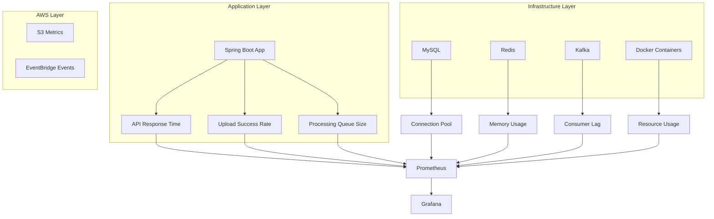

# 📊 Grafana + Prometheus 모니터링 설정 가이드

> CloudWatch 대신 오픈소스 모니터링 스택으로 완전한 observability 구축

## 🎯 **왜 Grafana + Prometheus인가?**

### ✅ **압도적인 장점들**
- **💰 무료**: CloudWatch 대비 월 수백달러 절약
- **🎨 아름다운 시각화**: 세계에서 가장 예쁜 대시보드
- **⚡ 실시간**: 초 단위 실시간 모니터링
- **🔗 통합**: 모든 시스템을 하나의 대시보드에서
- **🚀 확장성**: 대용량 메트릭 처리

### 📊 **모니터링할 시스템들**


---

## 🏗️ **전체 아키텍처**

```yaml
version: '3.8'
services:
  # 기존 서비스들
  mysql:
    # MySQL + mysql_exporter
  redis:
    # Redis + redis_exporter
  kafka:
    # Kafka + kafka_exporter

  # 모니터링 스택
  prometheus:
    # 메트릭 수집 및 저장
  grafana:
    # 시각화 및 알람
  node-exporter:
    # 시스템 메트릭
  cadvisor:
    # 컨테이너 메트릭
```

---

## 🚀 **1단계: Docker Compose 확장**

### 기존 docker-compose.yml에 추가

```yaml
# docker-compose.monitoring.yml
version: '3.8'

services:
  # ============================================
  # Prometheus - 메트릭 수집 및 저장
  # ============================================
  prometheus:
    image: prom/prometheus:v2.45.0
    container_name: orakgaraki-prometheus
    restart: unless-stopped
    ports:
      - "${PROMETHEUS_PORT:-9090}:9090"
    volumes:
      - prometheus_data:/prometheus
      - ./monitoring/prometheus/prometheus.yml:/etc/prometheus/prometheus.yml
      - ./monitoring/prometheus/rules:/etc/prometheus/rules
    command:
      - '--config.file=/etc/prometheus/prometheus.yml'
      - '--storage.tsdb.path=/prometheus'
      - '--storage.tsdb.retention.time=30d'
      - '--web.console.libraries=/etc/prometheus/console_libraries'
      - '--web.console.templates=/etc/prometheus/consoles'
      - '--web.enable-lifecycle'
      - '--web.enable-admin-api'
    networks:
      - monitoring

  # ============================================
  # Grafana - 시각화 및 대시보드
  # ============================================
  grafana:
    image: grafana/grafana:10.0.0
    container_name: orakgaraki-grafana
    restart: unless-stopped
    ports:
      - "${GRAFANA_PORT:-3000}:3000"
    environment:
      GF_SECURITY_ADMIN_USER: ${GRAFANA_ADMIN_USER:-admin}
      GF_SECURITY_ADMIN_PASSWORD: ${GRAFANA_ADMIN_PASSWORD:-admin123}
      GF_USERS_ALLOW_SIGN_UP: false
      GF_INSTALL_PLUGINS: grafana-piechart-panel,grafana-clock-panel,grafana-simple-json-datasource
    volumes:
      - grafana_data:/var/lib/grafana
      - ./monitoring/grafana/dashboards:/etc/grafana/provisioning/dashboards
      - ./monitoring/grafana/datasources:/etc/grafana/provisioning/datasources
    depends_on:
      - prometheus
    networks:
      - monitoring

  # ============================================
  # Node Exporter - 시스템 메트릭
  # ============================================
  node-exporter:
    image: prom/node-exporter:v1.6.0
    container_name: orakgaraki-node-exporter
    restart: unless-stopped
    ports:
      - "9100:9100"
    volumes:
      - /proc:/host/proc:ro
      - /sys:/host/sys:ro
      - /:/rootfs:ro
    command:
      - '--path.procfs=/host/proc'
      - '--path.rootfs=/rootfs'
      - '--path.sysfs=/host/sys'
      - '--collector.filesystem.mount-points-exclude=^/(sys|proc|dev|host|etc)($$|/)'
    networks:
      - monitoring

  # ============================================
  # cAdvisor - 컨테이너 메트릭
  # ============================================
  cadvisor:
    image: gcr.io/cadvisor/cadvisor:v0.47.0
    container_name: orakgaraki-cadvisor
    restart: unless-stopped
    ports:
      - "8080:8080"
    volumes:
      - /:/rootfs:ro
      - /var/run:/var/run:ro
      - /sys:/sys:ro
      - /var/lib/docker/:/var/lib/docker:ro
      - /dev/disk/:/dev/disk:ro
    privileged: true
    devices:
      - /dev/kmsg
    networks:
      - monitoring

  # ============================================
  # MySQL Exporter - MySQL 메트릭
  # ============================================
  mysql-exporter:
    image: prom/mysqld-exporter:v0.15.0
    container_name: orakgaraki-mysql-exporter
    restart: unless-stopped
    ports:
      - "9104:9104"
    environment:
      DATA_SOURCE_NAME: "${DB_USERNAME_LOCAL}:${DB_PASSWORD_LOCAL}@tcp(mysql:3306)/"
    depends_on:
      - mysql
    networks:
      - monitoring

  # ============================================
  # Redis Exporter - Redis 메트릭
  # ============================================
  redis-exporter:
    image: oliver006/redis_exporter:v1.52.0
    container_name: orakgaraki-redis-exporter
    restart: unless-stopped
    ports:
      - "9121:9121"
    environment:
      REDIS_ADDR: "redis://redis:6379"
      REDIS_PASSWORD: "${REDIS_PASSWORD}"
    depends_on:
      - redis
    networks:
      - monitoring

  # ============================================
  # Kafka Exporter - Kafka 메트릭
  # ============================================
  kafka-exporter:
    image: danielqsj/kafka-exporter:v1.6.0
    container_name: orakgaraki-kafka-exporter
    restart: unless-stopped
    ports:
      - "9308:9308"
    command:
      - '--kafka.server=kafka:29092'
      - '--web.listen-address=:9308'
    depends_on:
      - kafka
    networks:
      - monitoring

volumes:
  prometheus_data:
  grafana_data:

networks:
  monitoring:
    driver: bridge
```

---

## ⚙️ **2단계: Prometheus 설정**

### monitoring/prometheus/prometheus.yml

```yaml
global:
  scrape_interval: 15s
  evaluation_interval: 15s

rule_files:
  - "rules/*.yml"

scrape_configs:
  # Spring Boot 애플리케이션
  - job_name: 'orakgaraki-app'
    static_configs:
      - targets: ['host.docker.internal:8080']
    metrics_path: '/api/actuator/prometheus'
    scrape_interval: 10s

  # 시스템 메트릭
  - job_name: 'node-exporter'
    static_configs:
      - targets: ['node-exporter:9100']

  # 컨테이너 메트릭
  - job_name: 'cadvisor'
    static_configs:
      - targets: ['cadvisor:8080']

  # MySQL 메트릭
  - job_name: 'mysql'
    static_configs:
      - targets: ['mysql-exporter:9104']

  # Redis 메트릭
  - job_name: 'redis'
    static_configs:
      - targets: ['redis-exporter:9121']

  # Kafka 메트릭
  - job_name: 'kafka'
    static_configs:
      - targets: ['kafka-exporter:9308']

  # Prometheus 자체 모니터링
  - job_name: 'prometheus'
    static_configs:
      - targets: ['localhost:9090']

  # Grafana 모니터링
  - job_name: 'grafana'
    static_configs:
      - targets: ['grafana:3000']
```

### monitoring/prometheus/rules/upload_alerts.yml

```yaml
groups:
  - name: upload_system_alerts
    rules:
      # 업로드 실패율 높음
      - alert: HighUploadFailureRate
        expr: rate(upload_failed_total[5m]) / rate(upload_total[5m]) > 0.1
        for: 2m
        labels:
          severity: warning
        annotations:
          summary: "Upload failure rate is above 10%"
          description: "Upload failure rate is {{ $value | humanizePercentage }} for the last 5 minutes"

      # 처리 큐 적체
      - alert: ProcessingQueueBacklog
        expr: kafka_consumer_lag_sum > 1000
        for: 5m
        labels:
          severity: critical
        annotations:
          summary: "Processing queue has significant backlog"
          description: "Kafka consumer lag is {{ $value }} messages"

      # 데이터베이스 연결 부족
      - alert: LowDatabaseConnections
        expr: mysql_global_status_threads_connected / mysql_global_variables_max_connections > 0.8
        for: 3m
        labels:
          severity: warning
        annotations:
          summary: "MySQL connection pool nearly exhausted"
          description: "{{ $value | humanizePercentage }} of MySQL connections are in use"

      # 메모리 사용량 높음
      - alert: HighMemoryUsage
        expr: (1 - (node_memory_MemAvailable_bytes / node_memory_MemTotal_bytes)) > 0.9
        for: 5m
        labels:
          severity: critical
        annotations:
          summary: "High memory usage detected"
          description: "Memory usage is above 90%: {{ $value | humanizePercentage }}"

      # API 응답 시간 느림
      - alert: SlowAPIResponse
        expr: histogram_quantile(0.95, rate(http_request_duration_seconds_bucket[5m])) > 2
        for: 3m
        labels:
          severity: warning
        annotations:
          summary: "API response time is slow"
          description: "95th percentile response time is {{ $value }}s"
```

---

## 🔧 **3단계: Spring Boot Micrometer 연동**

### build.gradle.kts에 의존성 추가

```kotlin
dependencies {
    // 기존 의존성들...

    // Micrometer Prometheus 연동
    implementation("io.micrometer:micrometer-registry-prometheus")
    implementation("org.springframework.boot:spring-boot-starter-actuator")

    // 커스텀 메트릭용
    implementation("io.micrometer:micrometer-core")
}
```

### application.properties에 설정 추가

```properties
# ===============================================
# Actuator & Prometheus 설정
# ===============================================
management.endpoints.web.exposure.include=health,info,prometheus,metrics
management.endpoint.prometheus.enabled=true
management.endpoint.metrics.enabled=true
management.endpoint.health.show-details=always
management.metrics.export.prometheus.enabled=true

# 커스텀 메트릭 태그
management.metrics.tags.application=orakgaraki
management.metrics.tags.environment=${SPRING_PROFILES_ACTIVE:local}

# JVM 메트릭 활성화
management.metrics.enable.jvm=true
management.metrics.enable.system=true
management.metrics.enable.tomcat=true
management.metrics.enable.hikaricp=true
```

### 커스텀 메트릭 구현

```java
// monitoring/UploadMetrics.java
@Component
@RequiredArgsConstructor
@Slf4j
public class UploadMetrics {

    private final MeterRegistry meterRegistry;

    // 카운터 메트릭
    private final Counter uploadStarted;
    private final Counter uploadCompleted;
    private final Counter uploadFailed;
    private final Counter processingStarted;
    private final Counter processingCompleted;

    // 타이머 메트릭
    private final Timer uploadTimer;
    private final Timer processingTimer;

    // 게이지 메트릭
    private final AtomicLong activeUploads = new AtomicLong(0);
    private final AtomicLong queueSize = new AtomicLong(0);

    @PostConstruct
    public void initMetrics() {
        uploadStarted = Counter.builder("upload.started.total")
            .description("Total number of uploads started")
            .register(meterRegistry);

        uploadCompleted = Counter.builder("upload.completed.total")
            .description("Total number of uploads completed")
            .register(meterRegistry);

        uploadFailed = Counter.builder("upload.failed.total")
            .description("Total number of uploads failed")
            .register(meterRegistry);

        processingStarted = Counter.builder("processing.started.total")
            .description("Total number of processing jobs started")
            .register(meterRegistry);

        processingCompleted = Counter.builder("processing.completed.total")
            .description("Total number of processing jobs completed")
            .register(meterRegistry);

        uploadTimer = Timer.builder("upload.duration")
            .description("Upload duration from start to S3 completion")
            .register(meterRegistry);

        processingTimer = Timer.builder("processing.duration")
            .description("Processing duration from upload to completion")
            .register(meterRegistry);

        // 게이지 등록
        Gauge.builder("upload.active.count")
            .description("Number of currently active uploads")
            .register(meterRegistry, activeUploads, AtomicLong::get);

        Gauge.builder("processing.queue.size")
            .description("Current processing queue size")
            .register(meterRegistry, queueSize, AtomicLong::get);
    }

    // 이벤트 리스너들
    @EventListener
    public void onUploadStarted(UploadStartedEvent event) {
        uploadStarted.increment(
            Tags.of(
                "file.type", event.getFileType(),
                "file.size.category", categorizeFileSize(event.getFileSize())
            )
        );
        activeUploads.incrementAndGet();
    }

    @EventListener
    public void onUploadCompleted(UploadCompletedEvent event) {
        uploadCompleted.increment(
            Tags.of(
                "file.type", event.getFileType(),
                "processing.required", String.valueOf(event.requiresProcessing())
            )
        );
        activeUploads.decrementAndGet();

        // 업로드 시간 기록
        uploadTimer.record(event.getDuration(), TimeUnit.MILLISECONDS);
    }

    @EventListener
    public void onUploadFailed(UploadFailedEvent event) {
        uploadFailed.increment(
            Tags.of(
                "error.type", event.getErrorType(),
                "file.type", event.getFileType()
            )
        );
        activeUploads.decrementAndGet();
    }

    @EventListener
    public void onProcessingStarted(ProcessingStartedEvent event) {
        processingStarted.increment(
            Tags.of("job.type", event.getJobType())
        );
        queueSize.decrementAndGet();
    }

    @EventListener
    public void onProcessingCompleted(ProcessingCompletedEvent event) {
        processingCompleted.increment(
            Tags.of(
                "job.type", event.getJobType(),
                "status", event.getStatus().toString()
            )
        );

        // 처리 시간 기록
        processingTimer.record(event.getDuration(), TimeUnit.MILLISECONDS);
    }

    @EventListener
    public void onKafkaMessage(KafkaMessageReceivedEvent event) {
        queueSize.incrementAndGet();
    }

    private String categorizeFileSize(long sizeBytes) {
        if (sizeBytes < 1_000_000) return "small";      // < 1MB
        if (sizeBytes < 10_000_000) return "medium";    // < 10MB
        if (sizeBytes < 100_000_000) return "large";    // < 100MB
        return "xlarge";
    }
}

// monitoring/SystemMetrics.java
@Component
@RequiredArgsConstructor
public class SystemMetrics {

    private final DataSource dataSource;
    private final KafkaTemplate<String, String> kafkaTemplate;

    @Scheduled(fixedDelay = 30000) // 30초마다
    public void recordDatabaseMetrics() {
        try (var connection = dataSource.getConnection()) {
            var stmt = connection.prepareStatement(
                "SELECT " +
                "  (SELECT COUNT(*) FROM uploads WHERE processing_status = 'PENDING') as pending_uploads," +
                "  (SELECT COUNT(*) FROM uploads WHERE processing_status = 'PROCESSING') as processing_uploads," +
                "  (SELECT COUNT(*) FROM uploads WHERE created_at > NOW() - INTERVAL 1 HOUR) as uploads_last_hour"
            );

            var rs = stmt.executeQuery();
            if (rs.next()) {
                Gauge.builder("database.uploads.pending")
                    .register(Metrics.globalRegistry, rs.getLong("pending_uploads"));

                Gauge.builder("database.uploads.processing")
                    .register(Metrics.globalRegistry, rs.getLong("processing_uploads"));

                Gauge.builder("database.uploads.last_hour")
                    .register(Metrics.globalRegistry, rs.getLong("uploads_last_hour"));
            }
        } catch (SQLException e) {
            log.error("Failed to collect database metrics", e);
        }
    }
}
```

---

## 🎨 **4단계: Grafana 대시보드 설정**

### monitoring/grafana/datasources/prometheus.yml

```yaml
apiVersion: 1
datasources:
  - name: Prometheus
    type: prometheus
    access: proxy
    url: http://prometheus:9090
    isDefault: true
    editable: true
```

### monitoring/grafana/dashboards/dashboard.yml

```yaml
apiVersion: 1
providers:
  - name: 'default'
    orgId: 1
    folder: ''
    type: file
    disableDeletion: false
    updateIntervalSeconds: 10
    allowUiUpdates: true
    options:
      path: /etc/grafana/provisioning/dashboards
```

---

## 🚀 **5단계: 실행 및 접속**

### 모니터링 스택 시작

```bash
# 기존 서비스 + 모니터링 스택 함께 실행
docker-compose -f docker-compose.yml -f docker-compose.monitoring.yml up -d

# 또는 별도 실행
docker-compose -f docker-compose.monitoring.yml up -d
```

### 접속 정보

```bash
# Grafana 대시보드
http://localhost:3000
- Username: admin
- Password: admin123

# Prometheus 쿼리 인터페이스
http://localhost:9090

# 각종 Exporter들
http://localhost:9100  # Node Exporter
http://localhost:8080  # cAdvisor
http://localhost:9104  # MySQL Exporter
http://localhost:9121  # Redis Exporter
http://localhost:9308  # Kafka Exporter
```

---

## 📊 **6단계: 주요 대시보드 생성**

### 업로드 시스템 대시보드 쿼리들

```promql
# 초당 업로드 수
rate(upload_started_total[5m])

# 업로드 성공률
rate(upload_completed_total[5m]) / rate(upload_started_total[5m]) * 100

# 평균 업로드 시간
rate(upload_duration_sum[5m]) / rate(upload_duration_count[5m])

# 현재 활성 업로드 수
upload_active_count

# 처리 큐 크기
processing_queue_size

# API 응답 시간 (95th percentile)
histogram_quantile(0.95, rate(http_request_duration_seconds_bucket[5m]))

# 메모리 사용률
(1 - (node_memory_MemAvailable_bytes / node_memory_MemTotal_bytes)) * 100

# CPU 사용률
100 - (avg by (instance) (rate(node_cpu_seconds_total{mode="idle"}[5m])) * 100)

# MySQL 연결 수
mysql_global_status_threads_connected

# Kafka Consumer Lag
kafka_consumer_lag_sum

# Redis 메모리 사용량
redis_memory_used_bytes
```

---

## 🔔 **7단계: 알람 설정**

### Grafana 알람 규칙 예제

```json
{
  "alert": {
    "name": "High Upload Failure Rate",
    "frequency": "1m",
    "conditions": [
      {
        "query": {
          "queryType": "",
          "refId": "A",
          "model": {
            "expr": "rate(upload_failed_total[5m]) / rate(upload_started_total[5m]) > 0.1",
            "interval": "",
            "legendFormat": "",
            "refId": "A"
          }
        },
        "reducer": {
          "type": "last",
          "params": []
        },
        "evaluator": {
          "params": [0],
          "type": "gt"
        }
      }
    ],
    "notifications": [
      {
        "uid": "slack-notifications"
      }
    ]
  }
}
```

---

## 💡 **성능 최적화 팁**

### Prometheus 데이터 보존 정책

```yaml
# prometheus.yml
global:
  scrape_interval: 15s     # 운영환경에서는 30s 권장
  evaluation_interval: 15s

# 보존 기간 설정 (컨테이너 command에서)
--storage.tsdb.retention.time=30d  # 30일 보존
--storage.tsdb.retention.size=10GB # 최대 10GB
```

### 메트릭 샘플링 최적화

```java
// 고빈도 메트릭은 샘플링 적용
@Component
public class SampledMetrics {

    private final Random random = new Random();

    public void recordIfSampled(String metricName, double value) {
        // 10% 샘플링
        if (random.nextDouble() < 0.1) {
            Metrics.counter(metricName).increment(value);
        }
    }
}
```

---

## 🛡️ **보안 설정**

### Grafana 보안 강화

```yaml
# docker-compose.monitoring.yml
grafana:
  environment:
    # 기본 설정들...
    GF_SECURITY_SECRET_KEY: "your-secret-key-here"
    GF_SECURITY_DISABLE_GRAVATAR: true
    GF_ANALYTICS_REPORTING_ENABLED: false
    GF_ANALYTICS_CHECK_FOR_UPDATES: false
    GF_USERS_DEFAULT_THEME: dark
    GF_AUTH_ANONYMOUS_ENABLED: false
```

### Prometheus 접근 제한

```yaml
# nginx.conf (리버스 프록시)
server {
    location /prometheus/ {
        auth_basic "Prometheus";
        auth_basic_user_file /etc/nginx/.htpasswd;
        proxy_pass http://prometheus:9090/;
    }
}
```

---

## 📈 **CloudWatch vs Grafana+Prometheus 비교**

| 기능 | CloudWatch | Grafana+Prometheus |
|------|------------|-------------------|
| **비용** | 높음 ($100+/월) | 무료 |
| **커스터마이징** | 제한적 | 무제한 |
| **시각화** | 기본적 | 매우 아름다움 |
| **알람** | 유료 | 무료 무제한 |
| **데이터 보존** | 유료 | 자유롭게 설정 |
| **쿼리 언어** | 제한적 | PromQL (강력함) |
| **통합성** | AWS만 | 모든 시스템 |
| **학습 곡선** | 쉬움 | 보통 |

**결론: Grafana+Prometheus가 압도적으로 유리합니다!** 🎯

<function_calls>
<invoke name="TodoWrite">
<parameter name="todos">[{"content": "Grafana + Prometheus \uc124\uc815 \uac00\uc774\ub4dc \uc791\uc131", "status": "completed", "activeForm": "Grafana + Prometheus \uc124\uc815 \uac00\uc774\ub4dc \uc791\uc131 \uc911"}, {"content": "Docker Compose\uc5d0 \ubaa8\ub2c8\ud130\ub9c1 \uc2a4\ud0dd \ucd94\uac00", "status": "in_progress", "activeForm": "Docker Compose\uc5d0 \ubaa8\ub2c8\ud130\ub9c1 \uc2a4\ud0dd \ucd94\uac00 \uc911"}, {"content": "Spring Boot Micrometer \uc5f0\ub3d9 \uc124\uc815", "status": "pending", "activeForm": "Spring Boot Micrometer \uc5f0\ub3d9 \uc124\uc815 \uc911"}, {"content": "Grafana \ub300\uc2dc\ubcf4\ub4dc \uc608\uc81c \uc791\uc131", "status": "pending", "activeForm": "Grafana \ub300\uc2dc\ubcf4\ub4dc \uc608\uc81c \uc791\uc131 \uc911"}]