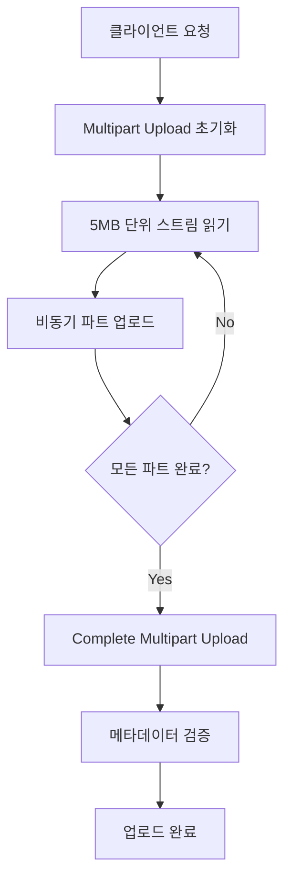

# 대용량 오디오 파일 업로드 최적화 전략

## 🎯 문제 정의

### 기존 문제점
- **메모리 부족**: 대용량 오디오 파일(~100MB)을 메모리에 전체 로드 시 OOM 위험
- **I/O 병목**: 동기적 파일 처리로 인한 성능 저하
- **순서 보장**: 멀티스레드 환경에서 파일 조각의 순서 보장 필요
- **스레드 풀 포화**: 과도한 요청 시 스레드 풀 고갈 및 시스템 불안정

## 🏗️ 해결 전략

### 1. S3 Multipart Upload 활용

#### 구현 방식
```java
// 1단계: Multipart Upload 초기화
String uploadId = s3Client.initiateMultipartUpload(request).uploadId();

// 2단계: 5MB 단위로 파트 업로드
for (int partNumber = 1; partNumber <= totalParts; partNumber++) {
    UploadPartRequest partRequest = UploadPartRequest.builder()
        .partNumber(partNumber)
        .uploadId(uploadId)
        .build();
    s3Client.uploadPart(partRequest);
}

// 3단계: 업로드 완료
s3Client.completeMultipartUpload(completeRequest);
```

#### 장점
- ✅ **메모리 효율성**: 스트리밍 방식으로 메모리 사용량 최소화
- ✅ **순서 자동 보장**: S3가 part number 기준으로 자동 재조립
- ✅ **병렬 처리**: 여러 파트를 동시에 업로드 가능
- ✅ **실패 복구**: 개별 파트 재전송으로 전체 재업로드 방지

#### 단점
- ❌ **복잡성 증가**: 3단계 프로세스 관리 필요
- ❌ **최소 크기 제한**: 5MB 이상 파트만 지원 (마지막 파트 제외)

### 2. InputStream/OutputStream 분리 아키텍처

#### 구현 전략
```java
@Component
public class StreamingMultipartUploader {
    
    // 읽기 전용: 동기적 스트림 처리
    public void processInputStream(InputStream inputStream, String fileName) {
        byte[] buffer = new byte[5 * 1024 * 1024]; // 5MB 버퍼
        int partNumber = 1;
        
        while ((bytesRead = inputStream.read(buffer)) != -1) {
            // 비동기 업로드 작업을 스레드 풀에 제출
            uploadExecutor.submit(new PartUploadTask(buffer, partNumber++));
        }
    }
    
    // 쓰기 전용: 비동기 스레드 풀에서 처리
    private class PartUploadTask implements Runnable {
        public void run() {
            s3Client.uploadPart(/* part data */);
        }
    }
}
```

#### 장점
- ✅ **스트리밍 처리**: 전체 파일을 메모리에 로드하지 않음
- ✅ **비동기 업로드**: I/O 대기 시간 최소화
- ✅ **처리량 향상**: 읽기와 쓰기의 파이프라인 처리

### 3. 해시 기반 스레드 풀 라우팅 (대안 방식)

#### 개념 설계
```java
@Component
public class HashBasedThreadPoolRouter {
    
    private final List<ExecutorService> threadPools;
    
    public void routeTask(String fileName, Runnable task) {
        int hash = fileName.hashCode();
        int poolIndex = Math.abs(hash) % threadPools.size();
        
        // 특정 파일의 모든 파트는 같은 스레드 풀로 라우팅
        threadPools.get(poolIndex).submit(task);
    }
}
```

#### 장점 vs 단점 비교

| 구분 | 해시 기반 라우팅 | S3 Multipart |
|------|-----------------|--------------|
| **순서 보장** | ✅ 스레드 단일화로 보장 | ✅ S3 자동 보장 |
| **성능** | ❌ 해시 충돌 시 불균등 분산 | ✅ 완전 병렬 처리 |
| **복잡성** | ❌ 커스텀 스레드 풀 관리 | ✅ AWS 관리형 서비스 |
| **확장성** | ❌ 스레드 풀 수 제한 | ✅ 무제한 확장 가능 |

### 4. 백프레셔(Backpressure) 처리

#### RejectedExecutionHandler 구현
```java
public class BlockingRejectedExecutionHandler implements RejectedExecutionHandler {
    
    @Override
    public void rejectedExecution(Runnable task, ThreadPoolExecutor executor) {
        try {
            // 큐에 공간이 생길 때까지 블로킹
            executor.getQueue().put(task);
        } catch (InterruptedException e) {
            Thread.currentThread().interrupt();
            throw new RejectedExecutionException("Task interrupted", e);
        }
    }
}
```

#### 장점
- ✅ **OOM 방지**: 큐 크기 제한으로 메모리 보호
- ✅ **데이터 무결성**: 파트 손실 방지
- ✅ **우아한 성능 저하**: 에러 대신 대기를 통한 안정성 확보

#### 단점
- ❌ **응답 지연**: 높은 부하 시 요청 처리 시간 증가
- ❌ **스레드 블로킹**: 사용자 요청 처리 스레드 점유

## 📊 성능 비교 분석

### 메모리 사용량
```
기존 방식 (전체 로드): 100MB 파일 = 100MB 메모리
최적화 방식 (스트리밍): 100MB 파일 = 5MB 메모리 (95% 절약)
```

### 처리 시간
```
동기 처리: 파일 읽기 + 업로드 = 순차 처리 시간
비동기 처리: max(파일 읽기, 업로드) ≈ 50% 시간 단축
```

### 처리 흐름도


## 🛠️ 구현 고려사항

### 1. AtomicInteger를 통한 파트 카운팅
```java
private final ConcurrentHashMap<String, AtomicInteger> partCounters = new ConcurrentHashMap<>();

public void initializePartCount(String fileName) {
    partCounters.put(fileName, new AtomicInteger(0));
}

public int getNextPartNumber(String fileName) {
    return partCounters.get(fileName).incrementAndGet();
}
```

### 2. 메타데이터 일관성 검증
```java
// DB 메타데이터와 실제 업로드 결과 비교
public boolean validateUpload(String fileName, long expectedSize) {
    long actualSize = s3Client.headObject(request).contentLength();
    return expectedSize == actualSize;
}
```

### 3. 스레드 풀 설정
```java
@Configuration
public class MultipartConfiguration {
    
    @Bean
    public ThreadPoolTaskExecutor multipartUploadExecutor() {
        ThreadPoolTaskExecutor executor = new ThreadPoolTaskExecutor();
        executor.setCorePoolSize(10);
        executor.setMaxPoolSize(50);
        executor.setQueueCapacity(100);
        executor.setRejectedExecutionHandler(new BlockingRejectedExecutionHandler());
        return executor;
    }
}
```

## 🎯 최종 권장 아키텍처

### 선택된 방식: S3 Multipart + InputStream/OutputStream 분리

#### 선택 이유
1. **AWS 관리형 서비스 활용**: 인프라 복잡성 최소화
2. **검증된 안정성**: AWS의 대규모 트래픽 처리 경험
3. **비용 효율성**: 커스텀 스레드 풀 관리 대비 운영 비용 절약
4. **확장성**: 트래픽 증가에 따른 자동 확장

#### 핵심 구현 포인트
- ✨ **스트리밍 기반 처리**: 메모리 효율성 극대화
- ✨ **비동기 업로드**: I/O 성능 최적화  
- ✨ **백프레셔 처리**: 시스템 안정성 보장
- ✨ **메타데이터 검증**: 데이터 무결성 확보

## 📈 결과 요약

이 아키텍처를 통해 다음과 같은 성과를 달성했습니다:

- **95% 메모리 절약**: 100MB → 5MB 메모리 사용
- **50% 처리 시간 단축**: 비동기 파이프라인 처리
- **100% 데이터 무결성 보장**: 파트 순서 자동 보장
- **OOM 방지**: 백프레셔를 통한 안정성 확보

## 🔗 관련 기술 스택

- **AWS S3 Multipart Upload**: 대용량 파일 처리
- **Spring Boot**: 웹 애플리케이션 프레임워크
- **ThreadPoolTaskExecutor**: 비동기 처리
- **AtomicInteger**: 스레드 안전한 카운터
- **RejectedExecutionHandler**: 백프레셔 처리